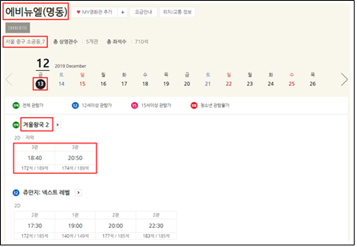
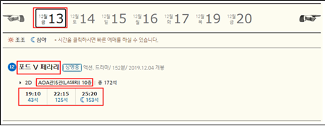
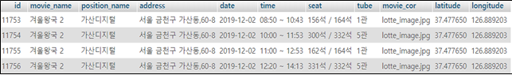
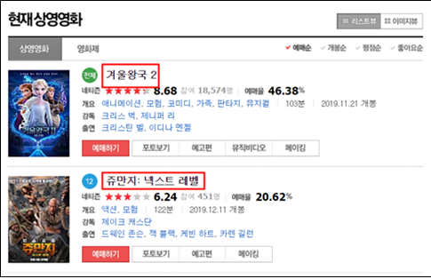
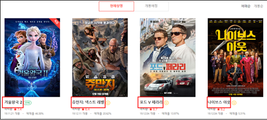
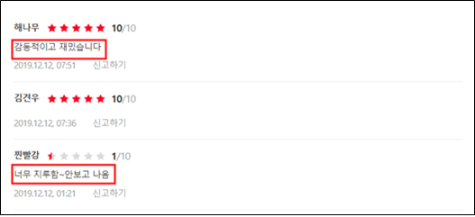
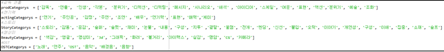
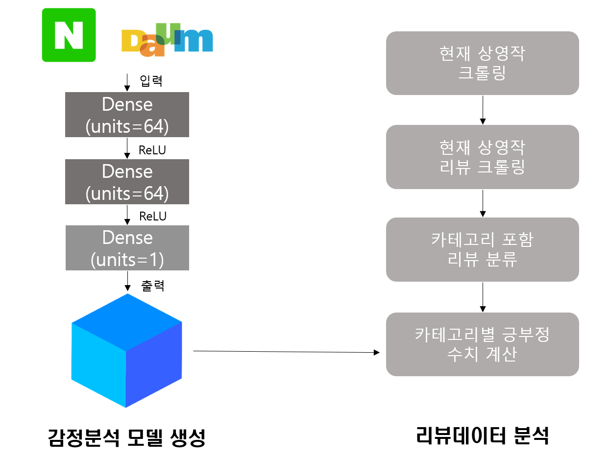
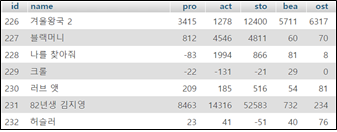

# MOVIE MOA

## 프로젝트 계획이유

현재 영화를 관람할 수 있는 영화관은 CGV, 롯데시네마, 메가박스 등 여러 브랜드가 존재합니다. 그래서 사용자는 주변의 영화관을 브랜드별로 따로 검색하여 시간을 비교하고 예매해야 하는 불편함이 있습니다. 또한 네이버 및 다음과 같은 각종 포털사이트에서 작성된 리뷰의 양은 매우 많고 신뢰성이 떨어집니다. 이러한 불편함을 해결하고자 웹 크롤링 기법을 통해 수집한 전국의 각 영화관 브랜드별 상영 시간표 데이터와 포털사이트의 리뷰 데이터를 가공하여 사용자 주변 영화관의 통합된 상영 시간표를 제공하고 리뷰 데이터를 영화 평가지표에 따라 분류하여 분석한 결과를 그래프로 시각화하여 사용자들에게 제공하는 기능을 가진 종합 영화 어플리케이션 MOVIE MOA를 계획했습니다.

## 크롤링 웹사이트 및 수집 컨텐츠
### 영화 상영 시간표

 
 
 

 

 
모든 상영시간표 데이터를 수집하기 위해 메가박스, 롯데시네마, CGV의 웹사이트를 선정했습니다. 각 웹사이트에서 전국 모든 지점의 당일 포함 4일치의 영화 제목, 지점 이름, 주소, 날짜, 시간, 잔여석, 관의 정보를 수집합니다. 수집된 데이터는 파이썬의 pymysql라이브러리를통해 카페24로 호스팅한 마리아DB에 저장했습니다.

### 영화 리뷰

 

 

 

 
네이버와 다음의 영화 리뷰 웹사이트를 선정했습니다. 현재 상영작 웹사이트에서 상영하는 영화들의 movieId 데이터를 수집합니다. 그 후 수집된 movieId데이터를 이용하여 영화 리뷰 웹사이트를 찾고 리뷰 데이터를 수집합니다.
수집된 리뷰 데이터는 감정분석 모델의 추가학습자료와 영화의 평가지표별 점수를 수치화에 사용됩니다. 수치화된 점수 데이터는 파이썬의 pymysql라이브러리를 통해 카페24로 호스팅한 마리아DB에 저장합니다.

## 리뷰 데이터 분석
### 리뷰 전처리 방법
형태소분석기인 Konlpy의 okt를 사용하여 품사를 태깅하고 nltk를 사용하여 출현 빈도수가 높은 단어를 추출하여 벡터화시켜 학습모델의 데이터로 사용하였습니다.
### 데이터 사전

 
감독연출, 연기력, 스토리, OST, 영상미 등의 평가 기준별 데이터 사전을 구축하여 리뷰의 내용에 데이터 사전의 단어가 포함될 시 해당 평가 기준에 관련된 리뷰로 판단하고 기준별로 분류하였습니다.
### 분석 방법

 

 
tensorflow 환경의 딥러닝 모델 설계와 훈련을 위한 고수준 API인 케라스를 사용하여 리뷰 긍·부정 예측 모델을 생성하였고 앞서 말한 평가 기준별로 분류된 리뷰를 데이터로 넣어 긍·부정 수치를 구합니다.

## Built With
* [tkdals2317](https://github.com/tkdals2317)
