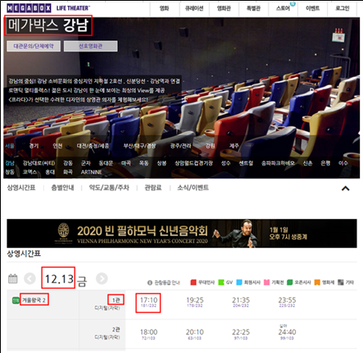
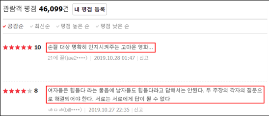

# MOVIE MOA

## 프로젝트 계획이유

현재 영화를 관람할 수 있는 영화관은 CGV, 롯데시네마, 메가박스 등 여러 브랜드가 존재합니다. 그래서 사용자는 주변의 영화관을 브랜드별로 따로 검색하여 시간을 비교하고 예매해야 하는 불편함이 있습니다. 또한 네이버 및 다음과 같은 각종 포털사이트에서 작성된 리뷰의 양은 매우 많고 신뢰성이 떨어집니다. 이러한 불편함을 해결하고자 웹 크롤링 기법을 통해 수집한 전국의 각 영화관 브랜드별 상영 시간표 데이터와 포털사이트의 리뷰 데이터를 가공하여 사용자 주변 영화관의 통합된 상영 시간표를 제공하고 리뷰 데이터를 영화 평가지표에 따라 분류하여 분석한 결과를 그래프로 시각화하여 사용자들에게 제공하는 기능을 가진 종합 영화 어플리케이션 MOVIE MOA를 계획했습니다.

## 크롤링 웹사이트 및 수집 컨텐츠
### 영화 상영 시간표
  
 

모든 상영시간표 데이터를 수집하기 위해 메가박스, 롯데시네마, CGV의 웹사이트를 선정했습니다. 각 웹사이트에서 전국 모든 지점의 당일 포함 4일치의 영화 제목, 지점 이름, 주소, 날짜, 시간, 잔여석, 관의 정보를 수집합니다. 수집된 데이터는 파이썬의 pymysql라이브러리를통해 카페24로 호스팅한 마리아DB에 저장했습니다.

### 시퀀스 다이어그램

## Screenshot
### 메인화면

 
우측 하단의 플로팅 버튼을 통해 사진을 입력을 시작할 수 있습니다.
### 사진 입력 방법
  
 
사진을 입력하는 방법은 두 가지가 있으며, 카메라를 눌러 즉시 사진을 찍거나 사진첩을 눌러 로컬 저장소에 있는 사진을 불러올 수 있습니다.
### 로딩

 
입력한 사진의 데이터를 정제하는 과정이 필요합니다.
### 결과 출력

 
성분에 대한 정보를 리사이클러뷰 형태로 제공하며, 리사이클러뷰의 항목을 클릭하면 해당 항목에 대한 위키백과 상세정보를 제공한다.

## 활용 범위
### 활용 분야
어플리케이션을 통한 서비스만이 아닌 식료품점, 약국 등 식품 성분표 규격에 맞는 기기를 생산하여 아이오티를 통해 성분, 재료 정보 제공 서비스로 발전할 수 있습니다.
### 기대효과
* 사진만 찍으면 되는 간편한 사용법으로 스마트폰에 익숙하지 않은 사람도 식품 성분표에 대한 정보를 얻을 수 있으므로 식품을 구매할 때 도움이 될 수 있습니다.
* OCR 기능을 통하여 사진에서 글자를 인식하므로 작은 공간에 빽빽하게 쓰여진 작은 성분들을 쉽게 인지할 수 있습니다.
* 번역기능을 제공하여 외국어로 되어있는 성분에 대해서도 알레르기로 인한 부작용을 방지할 수 있습니다.
* 약품이나 식품의 성분에 대한 지식이 부족한 사용자들도 위키백과 QA API의 자세한 설명을 확인할 수 있습니다.

## Built With

* [tkdals2317](https://github.com/tkdals2317)
* [bongdaehyun](https://github.com/bongdaehyun)
* [JI Kyu-Bin](https://github.com/jie1029)
